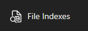
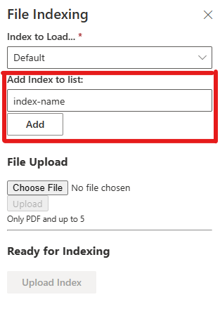
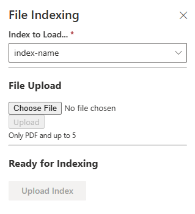
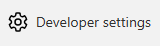
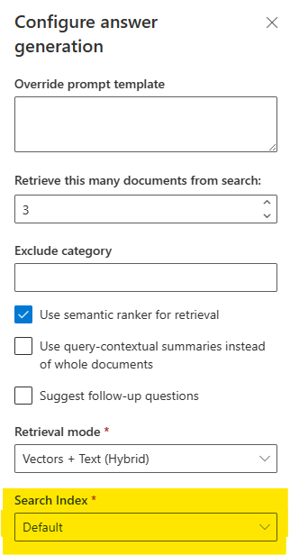

# IMPORANT THIS REPO was copied from https://github.com/Azure-Samples/azure-search-openai-demo on 07262023 and altered to include
* Calling AOAI through an APIM using the app configuration AZURE_APIM_OPENAI_URL
* Updated the bicep to allow for an AZURE Resource group for the webapp in configuration
* removed workflows for git actions
* Added White boxing to add features
* To run the custom doc prep, delete the existing index, place the custom documents in `./data_custom/` directory and run the `./scripts/prepdocs_custom.ps1` or `./scripts/prepdocs_custom.sh`
* Upload of files for the document chat

## To setup with azd in cloud shell (cloud shell automatically authenticates to the user but multiple subscriptions do require `azd auth login` command)
1. Create a new directory for the deployment
1. You will need to login using `azd auth login` to run the python scripts 
1. `azd init -t Patrick-Davis-MSFT/azure-search-openai-demo-altered` Note: This will not link the downloaded solution to the git repo
1. Choose to overwrite the files if no if you cloned and/or made changes locally 
1. Add the `AZURE_OPENAI_RESOURCE_GROUP` and `AZURE_OPENAI_SERVICE` to the `.azure/{enviroment-name}/.env` file 
1. Update the other parameters in the `.azure` folder as needed
1. If running on the Cloud shell set all scripts in the `scripts` folder to execute using `chmod -R 777 scripts`
1. Deploy the files with `azd up`

**Important** to target resources in a specific group make sure to update the `.env` file in the .azure folder with the following value
* AZURE_ENV_NAME="" <-- AZD environment name (do not change this after initialization)
* AZURE_FORMRECOGNIZER_RESOURCE_GROUP="" <-- form recognizer resource group name
* AZURE_FORMRECOGNIZER_SERVICE="" <-- form recognizer service name
* AZURE_LOCATION="eastus" <-- location
* AZURE_OPENAI_CHATGPT_DEPLOYMENT="" <-- Chat deployment name must use 0301 or later
* AZURE_OPENAI_EMB_DEPLOYMENT="" <-- Ada deployment name must use model 2 or later
* AZURE_OPENAI_GPT_DEPLOYMENT="" <-- Davinci deployment name must use model 0301 or later
* AZURE_OPENAI_RESOURCE_GROUP="" <-- <b>REQUIRED</b> Azure Open AI Resource Group
* AZURE_OPENAI_SERVICE="" <-- <b>REQUIRED</b> Azure Open AI service Name
* AZURE_RESOURCE_GROUP="" <--  Resource group for Web App
* AZURE_SEARCH_INDEX="" <-- Search service index
* AZURE_SEARCH_SERVICE="" <-- Search service name
* AZURE_SEARCH_SERVICE_RESOURCE_GROUP="" <-- Search service resource group
* AZURE_STORAGE_ACCOUNT="" <-- Storage account name
* AZURE_STORAGE_CONTAINER="" <-- Storage account container
* AZURE_STORAGE_RESOURCE_GROUP="" <-- Resource group for the storage account
* AZURE_SUBSCRIPTION_ID= "" <-- Azure Subscription ID
* AZURE_TENANT_ID= "" <-- for authenication
* AZURE_AOAI_SYSTEM_PROMPT="" <-- optional to change the default system prompt
* AZURE_AOAI_FOLLOWUP_PROMPT="" <-- Optional to change the default followup prompt 

If deploying through the docker file you will need the following environmental variable from the service principal 
AZURE_CLIENT_ID=VALUE
AZURE_CLIENT_SECRET=VALUE
The service principal will need the following
* Search Service - Search Index Data Contributor (Reader is not sufficient)
* Storage account - Storage Blob Data Contributor (Reader is not sufficient)
* Azure OpenAI Service - Cognitive Services User

To build a docker container to build from the root directory use the following command.

`docker build . -t image-name`

To run locally using the docker compose functionality update the environmental variables and image name in the docker-compose.yml file. The enviromental variables values are in the `.azure\[AZD Environment Name]\.env` file. Then run the following command

`docker-compose -f ./docker-compose.yml up`

Add all Azure Developer CLI variables and the additional 2 above to the Docker compose file or the webapp configuration or any combination of the two.

To run through the APIM using the following variable
AZURE_APIM_OPENAI_URL=APIM_API_ENDPOINT_URL


# ChatGPT + Enterprise data with Azure OpenAI and Cognitive Search

[](https://github.com/codespaces/new?hide_repo_select=false&ref=main&repo=671209901&machine=standardLinux32gb&devcontainer_path=.devcontainer%2Fdevcontainer.json&location=WestUs2)
[](https://vscode.dev/redirect?url=vscode://ms-vscode-remote.remote-containers/cloneInVolume?url=https://github.com/Patrick-Davis-MSFT/azure-search-openai-demo-altered)

This sample demonstrates a few approaches for creating ChatGPT-like experiences over your own data using the Retrieval Augmented Generation pattern. It uses Azure OpenAI Service to access the ChatGPT model (gpt-35-turbo), and Azure Cognitive Search for data indexing and retrieval.

The repo includes sample data so it's ready to try end to end. In this sample application we use a fictitious company called Contoso Electronics, and the experience allows its employees to ask questions about the benefits, internal policies, as well as job descriptions and roles.


## Features

* Chat and Q&A interfaces
* Explores various options to help users evaluate the trustworthiness of responses with citations, tracking of source content, etc.
* Shows possible approaches for data preparation, prompt construction, and orchestration of interaction between model (ChatGPT) and retriever (Cognitive Search)
* Settings directly in the UX to tweak the behavior and experiment with options


### To Upload Documents to the Default Index or a New Search Index

> <b>Note</b>: This functionality may be disabled in the `.\app\frontend\src\components\WhiteBox\WhiteBox.tsx` file 

> Using other indexes requires the selection of that index in the developer settings in order to search on those documents.

An index is a set of documents scanned for retrieval by Azure Open AI. 

1. Click on the File Indexes button



2. Select the index to load to. The Default index will be used by default. 



2-a. To add a new Index for documents type in the name of the index in `Add Index to List:` Indexes names need to be lowercase and letters and dashes only. <i>No numbers or spaces.</i>
2-b. Click `Add`
2-c. Select the name from `Indexes to Load...`



3. Select `Choose File to upload` to select the files from your hard drive to upload
    > Only PDFs can be uploaded and only 5 files can be uploaded at a time. Larger PDFs may need to be uploaded individually. 
1. Click `Upload` to stage the date
1. Once files are listed in the `Ready for Indexing` section, Press the Upload Index. 
1. The loading screen will appear. 
1. Once started the a new file will be added to the Indexing Files called `[UID]!!!IndexThis.json`.
1. If there is an error on the Function app in the Azure Logs or the function failed. Remove the `IndexThis` file and Press `Upload Index` again to restart.
1. The function will automatically time out after 3 hours but will retry up to 5 times. Indexing can take some time.
1. As the files get indexed the files will be removed from the list.

### To Use a Non-`Default` Index for Searching Uploaded Document
1. Select Developer settings 



2. Select the index for the documents required



## Getting Started

> **IMPORTANT:** In order to deploy and run this example, you'll need an **Azure subscription with access enabled for the Azure OpenAI service**. You can request access [here](https://aka.ms/oaiapply). You can also visit [here](https://azure.microsoft.com/free/cognitive-search/) to get some free Azure credits to get you started.

> **AZURE RESOURCE COSTS** by default this sample will create Azure App Service and Azure Cognitive Search resources that have a monthly cost, as well as Form Recognizer resource that has cost per document page. You can switch them to free versions of each of them if you want to avoid this cost by changing the parameters file under the infra folder (though there are some limits to consider; for example, you can have up to 1 free Cognitive Search resource per subscription, and the free Form Recognizer resource only analyzes the first 2 pages of each document.)

### Prerequisites

#### To Run Locally

* [Azure Developer CLI](https://aka.ms/azure-dev/install)
* [Python 3+](https://www.python.org/downloads/)
  * **Important**: Python and the pip package manager must be in the path in Windows for the setup scripts to work.
  * **Important**: Ensure you can run `python --version` from console. On Ubuntu, you might need to run `sudo apt install python-is-python3` to link `python` to `python3`.
* [Node.js](https://nodejs.org/en/download/)
* [Git](https://git-scm.com/downloads)
* [Powershell 7+ (pwsh)](https://github.com/powershell/powershell) - For Windows users only.
  * **Important**: Ensure you can run `pwsh.exe` from a PowerShell command. If this fails, you likely need to upgrade PowerShell.
* [Bicep](https://learn.microsoft.com/en-us/azure/azure-resource-manager/bicep/install)
* [Azure Functions Extension for VS Code](https://marketplace.visualstudio.com/items?itemName=ms-azuretools.vscode-azurefunctions) or [Azure Core Tools](https://www.npmjs.com/package/azure-functions-core-tools) for locally running the function app for indexing

>NOTE: Your Azure Account must have `Microsoft.Authorization/roleAssignments/write` permissions, such as [User Access Administrator](https://learn.microsoft.com/azure/role-based-access-control/built-in-roles#user-access-administrator) or [Owner](https://learn.microsoft.com/azure/role-based-access-control/built-in-roles#owner).  

#### To Run in GitHub Codespaces or VS Code Remote Containers

You can run this repo virtually by using GitHub Codespaces or VS Code Remote Containers.  Click on one of the buttons below to open this repo in one of those options.

[](https://github.com/codespaces/new?hide_repo_select=true&ref=main&repo=671209901&machine=standardLinux32gb&devcontainer_path=.devcontainer%2Fdevcontainer.json&location=WestUs2)
[](https://vscode.dev/redirect?url=vscode://ms-vscode-remote.remote-containers/cloneInVolume?url=https://github.com/Patrick-Davis-MSFT/azure-search-openai-demo-altered)

### Installation

#### Project Initialization

1. Create a new folder and switch to it in the terminal
1. Run `azd auth login`
1. Run `azd init -t Patrick-Davis-MSFT/azure-search-openai-demo-altered`
    * note that this command will download this repository but will not initialize git.

#### Starting from scratch

Execute the following command, if you don't have any pre-existing Azure services and want to start from a fresh deployment.

1. Run `azd up` - This will provision Azure resources and deploy this sample to those resources, including building the search index based on the files found in the `./data` folder.
    * For the target location, the regions that currently support the models used in this sample are **East US**, **France Central**, **South Central US**, **UK South**, and **West Europe**. For an up-to-date list of regions and models, check [here](https://learn.microsoft.com/azure/cognitive-services/openai/concepts/models#model-summary-table-and-region-availability).
1. After the application has been successfully deployed you will see a URL printed to the console.  Click that URL to interact with the application in your browser.  

It will look like the following:


> NOTE: It may take a minute for the application to be fully deployed. If you see a "Python Developer" welcome screen, then wait a minute and refresh the page.

#### Using existing resources

1. Run `azd env set AZURE_OPENAI_SERVICE {Name of existing OpenAI service}`
1. Run `azd env set AZURE_OPENAI_RESOURCE_GROUP {Name of existing resource group that OpenAI service is provisioned to}`
1. Run `azd env set AZURE_OPENAI_CHATGPT_DEPLOYMENT {Name of existing ChatGPT deployment}`. Only needed if your ChatGPT deployment is not the default 'chat'.
1. Run `azd env set AZURE_OPENAI_GPT_DEPLOYMENT {Name of existing GPT deployment}`. Only needed if your ChatGPT deployment is not the default 'davinci'.
1. Run `azd env set AZURE_OPENAI_EMB_DEPLOYMENT {Name of existing GPT embedding deployment}`. Only needed if your embeddings deployment is not the default 'embedding'.
1. Run `azd up`

> NOTE: You can also use existing Search and Storage Accounts.  See `./infra/main.parameters.json` for list of environment variables to pass to `azd env set` to configure those existing resources.

#### Deploying again

If you've only changed the backend/frontend code in the `app` folder, then you don't need to re-provision the Azure resources. You can just run:

```azd deploy```

If you've changed the infrastructure files (`infra` folder or `azure.yaml`), then you'll need to re-provision the Azure resources. You can do that by running:

```azd up```

#### Running locally

##### Web App
1. Run `azd auth login`
2. Change dir to `app`
3. Run `./start.ps1` or `./start.sh` or run the "VS Code Task: Start App" to start the project locally.

##### Function App (For Indexing)
> Remember to Stop the Azure Function that is deployed in Azure to prevent the triggers from double firing 
1. Open a new Powershell Terminal. 
1. If not done so run `azd auth login`
1. Change directories to `app-func`
1. Run the command `./start.ps1`

#### Sharing Environments

To give someone else access to a completely deployed and existing environment,
either you or they can follow these steps:

1. Install the [Azure CLI](https://learn.microsoft.com/cli/azure/install-azure-cli)
1. Run `azd init -t Patrick-Davis-MSFT/azure-search-openai-demo-altered` or clone this repository.
1. Run `azd env refresh -e {environment name}`
   They will need the azd environment name, subscription ID, and location to run this command. You can find those values in your `.azure/{env name}/.env` file.  This will populate their azd environment's `.env` file with all the settings needed to run the app locally.
1. Set the environment variable `AZURE_PRINCIPAL_ID` either in that `.env` file or in the active shell to their Azure ID, which they can get with `az account show`.
1. Run `./scripts/roles.ps1` or `.scripts/roles.sh` to assign all of the necessary roles to the user.  If they do not have the necessary permission to create roles in the subscription, then you may need to run this script for them. Once the script runs, they should be able to run the app locally.

### Quickstart

* In Azure: navigate to the Azure WebApp deployed by azd. The URL is printed out when azd completes (as "Endpoint"), or you can find it in the Azure portal.
* Running locally: navigate to 127.0.0.1:5000

Once in the web app:

* Try different topics in chat or Q&A context. For chat, try follow up questions, clarifications, ask to simplify or elaborate on answer, etc.
* Explore citations and sources
* Click on "settings" to try different options, tweak prompts, etc.

## Resources

* [Revolutionize your Enterprise Data with ChatGPT: Next-gen Apps w/ Azure OpenAI and Cognitive Search](https://aka.ms/entgptsearchblog)
* [Azure Cognitive Search](https://learn.microsoft.com/azure/search/search-what-is-azure-search)
* [Azure OpenAI Service](https://learn.microsoft.com/azure/cognitive-services/openai/overview)

### Note

>Note: The PDF documents used in this demo contain information generated using a language model (Azure OpenAI Service). The information contained in these documents is only for demonstration purposes and does not reflect the opinions or beliefs of Microsoft. Microsoft makes no representations or warranties of any kind, express or implied, about the completeness, accuracy, reliability, suitability or availability with respect to the information contained in this document. All rights reserved to Microsoft.

### FAQ

<details>
<summary>Why do we need to break up the PDFs into chunks when Azure Cognitive Search supports searching large documents?</summary>

Chunking allows us to limit the amount of information we send to OpenAI due to token limits. By breaking up the content, it allows us to easily find potential chunks of text that we can inject into OpenAI. The method of chunking we use leverages a sliding window of text such that sentences that end one chunk will start the next. This allows us to reduce the chance of losing the context of the text.
</details>

<details>
<summary>How can we upload additional PDFs without redeploying everything?</summary>

To upload more PDFs, put them in the data/ folder and run `./scripts/prepdocs.sh` or `./scripts/prepdocs.ps1`. To avoid reuploading existing docs, move them out of the data folder. You could also implement checks to see whats been uploaded before; our code doesn't yet have such checks.
</details>

### Troubleshooting


Here are the most common failure scenarios and solutions:

1. The subscription (`AZURE_SUBSCRIPTION_ID`) doesn't have access to the Azure OpenAI service. Please ensure `AZURE_SUBSCRIPTION_ID` matches the ID specified in the [OpenAI access request process](https://aka.ms/oai/access).

1. You're attempting to create resources in regions not enabled for Azure OpenAI (e.g. East US 2 instead of East US), or where the model you're trying to use isn't enabled. See [this matrix of model availability](https://aka.ms/oai/models).

1. The following roles require assignments. If it is not possible to be an administrator on the subscription you should be allowed to assign these roles to service principals 

      ``` bash       
      5e0bd9bd-7b93-4f28-af87-19fc36ad61bd - Cognitive Services OpenAI User
      a97b65f3-24c7-4388-baec-2e87135dc908 - Cognitive Services User
      2a2b9908-6ea1-4ae2-8e65-a410df84e7d1 - Storage Blob Data Reader
      ba92f5b4-2d11-453d-a403-e96b0029c9fe - Storage Blob Data Contributor
      1407120a-92aa-4202-b7e9-c0e197c71c8f - Search Index Data Reader
      8ebe5a00-799e-43f5-93ac-243d3dce84a7 - Search Index Data Contributor
      7ca78c08-252a-4471-8644-bb5ff32d4ba0 - Search Service Contributor
      ```

1. You've exceeded a quota, most often number of resources per region. See [this article on quotas and limits](https://aka.ms/oai/quotas).

1. You're getting "same resource name not allowed" conflicts. That's likely because you've run the sample multiple times and deleted the resources you've been creating each time, but are forgetting to purge them. Azure keeps resources for 48 hours unless you purge from soft delete. See [this article on purging resources](https://learn.microsoft.com/azure/cognitive-services/manage-resources?tabs=azure-portal#purge-a-deleted-resource).

1. After running `azd up` and visiting the website, you see a '404 Not Found' in the browser. First, try running `azd deploy`. If you still encounter errors with the deployed app, consult these [tips for debugging Flask app deployments](http://blog.pamelafox.org/2023/06/tips-for-debugging-flask-deployments-to.html)
and file an issue if the error logs don't help you resolve the issue.
